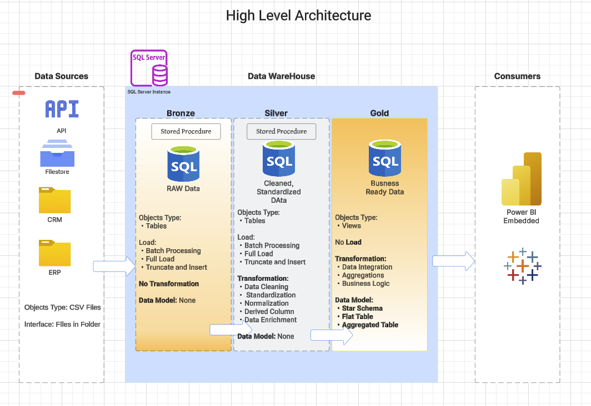

# Welcome to the **Data Warehouse Pipeline with Medallion Architecture** repository !

## A PostgreSQL-based implementation following modern data engineering best practices

### High Level Architecture of the ETL pipeline Flow

📌 Project Overview
This project ingests two flat-file data sources from external systems into a PostgreSQL data warehouse, implementing a Medallion Architecture (Landing → Bronze → Silver → Gold) with:

- Automated data quality checks

- End-to-end lineage tracking

- Documented data models (Conceptual → Logical → Physical)

- Business-ready Gold layer

### Medallion Architecture Flow

*Built with:*
- PostgreSQL
- Python
- Great Expectations
