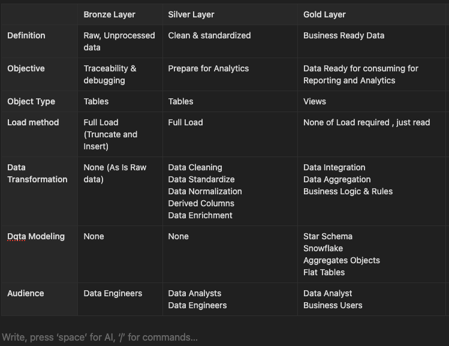

# Welcome to the **Data Warehouse Pipeline with Medallion Architecture** repository !

## A PostgreSQL-based implementation following modern data engineering best practices

### High Level Architecture of the ETL pipeline Flow

📌 Project Overview
This project ingests two flat-file data sources from external systems into a PostgreSQL data warehouse, implementing a Medallion Architecture (Landing → Bronze → Silver → Gold) with:

- Automated data quality checks

- End-to-end lineage tracking

- Documented data models (Conceptual → Logical → Physical)

- Business-ready Gold layer

### Medallion Architecture Flow

_Built with:_

- PostgreSQL
- Python
- Great Expectations

### 🚀 Next Steps & Roadmap

#### Pipeline Enhancement

1. _Orchestration Implementation_

- Set up Airflow to automate end-to-end Silver→Gold layer execution
- Configure task dependencies to ensure proper sequencing
- Add data quality gates between transformation stages

2. _Incremental Processing_

- Implement Change Data Capture (CDC) for efficient updates
- Design merge strategies for SCD Type 2 dimensions

3. _Multi-Source Integration_

- Phase 1: Add API-based CRM data (REST endpoints)
- Phase 2: Stream Open Source free data via Kafka
- Phase 3: Automate data pipleline components using DBT

📚 Learning Credits
This project is developed with guidance from:
Datasets: Modified samples from Kaggle Retail Dataset
Architecture: Inspired by Medallion Architecture - Databricks

Tutorials: Special thanks to [Data with Baraa](https://www.youtube.com/@DataWithBaraa) YouTube channel for:
▶️ Building a Modern Data Warehouse
▶️ PostgreSQL Optimization Techniques
